# 1. ShadowMeld 🕶️

**Stealthy Shellcode Embedding**  **&amp;**  **Carrier Loader Generator**
*A Tauri+Rust tool to hide payloads in media files and generate undetectable loaders.*

<div align="center">
  
  [](https://www.rust-lang.org/)
  [](https://tauri.app/)
  [](https://www.apache.org/licenses/)
  
</div>
---

## 1.1 🔍 项目概述

**ShadowMeld** 是一个针对安全研究者的**隐蔽数据嵌入工具**，可将二进制载荷（如 Shellcode）无缝注入png，bmp等常见文件格式，并生成专用的内存加载器（Loader），实现**无文件痕迹**的隐蔽执行。

> 更多内容详见博客: [https://www.cnblogs.com/bktown/p/18775589/tauri-newbie-shellcode-loader-based-on-lsb-steganography-zfguxj](https://www.cnblogs.com/bktown/p/18775589/tauri-newbie-shellcode-loader-based-on-lsb-steganography-zfguxj)
---

## 1.2 🚀 功能特性

* **支持载体格式**：PNG, BMP（LSB/频域隐写）
* **内存加载**：直接从载体文件提取并映射 Shellcode 到内存
* **反调试技术**：时钟检测、硬件断点清除、ETW 旁路
* **反沙箱技术**：隐藏黑框、CPU及内存检测

---

## 1.3 📸 截图预览


---

## 1.4 🛠️ 安装与使用

### 1.4.1 依赖项

* Rust 1.70+
* Tauri CLI (`cargo install tauri-cli`)
* Windows：需安装 WebView2


### 1.4.2 快速开始

```bash
# 克隆项目  
git clone https://github.com/BKLockly/ShadowMeld  

# 编译并运行  
cd ShadowMeld  
cargo tauri dev  

# 生产环境构建  
cargo tauri build --release  
```


### 1.4.3 基础使用
> ❗注意不要动template.exe否则生成loader会失败！
1. **嵌入 Shellcode:**  在GUI中选择载体文件和 Shellcode.bin
2. **填充密钥:** 自行指定或随机生成
3. **生成 Loader:**  提供含载荷的图片和loader的保存位置

---

## 1.5 🐋 测试情况
### 沙箱
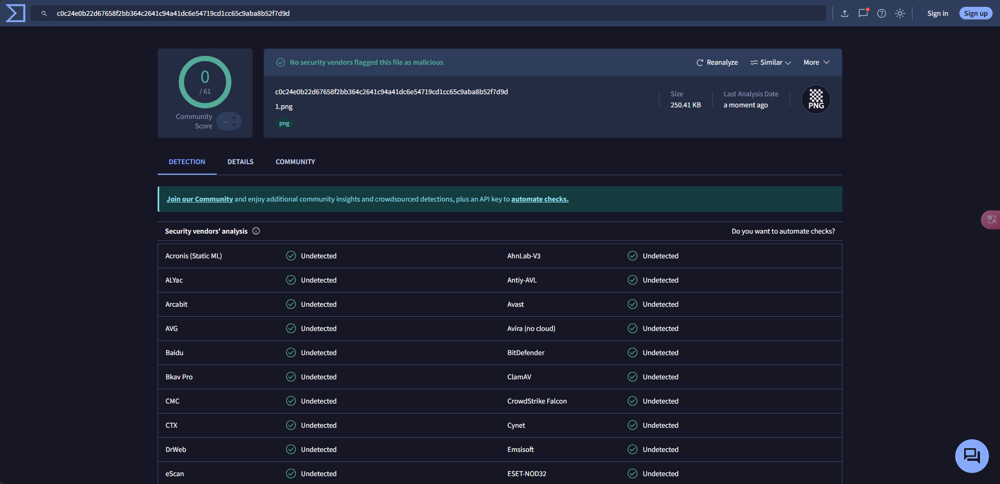
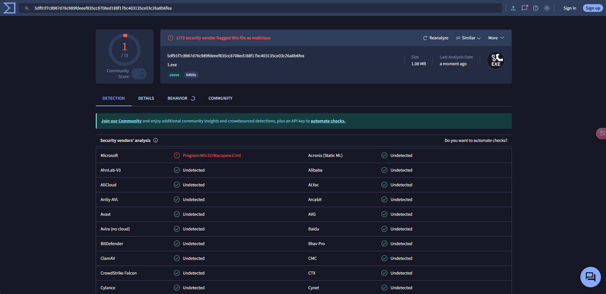

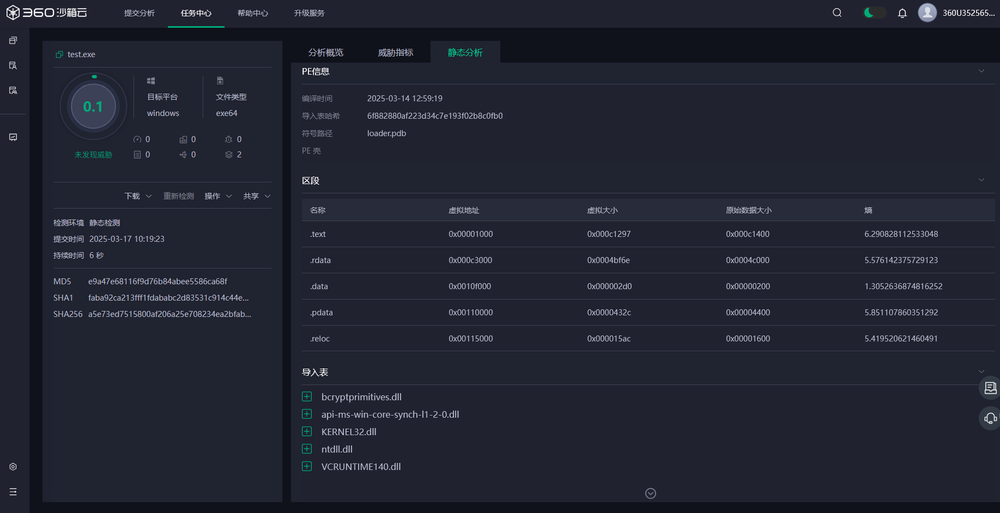
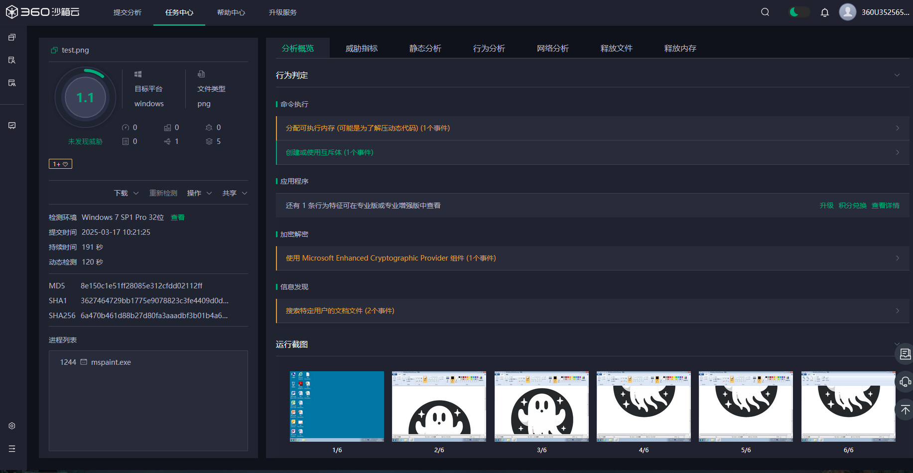

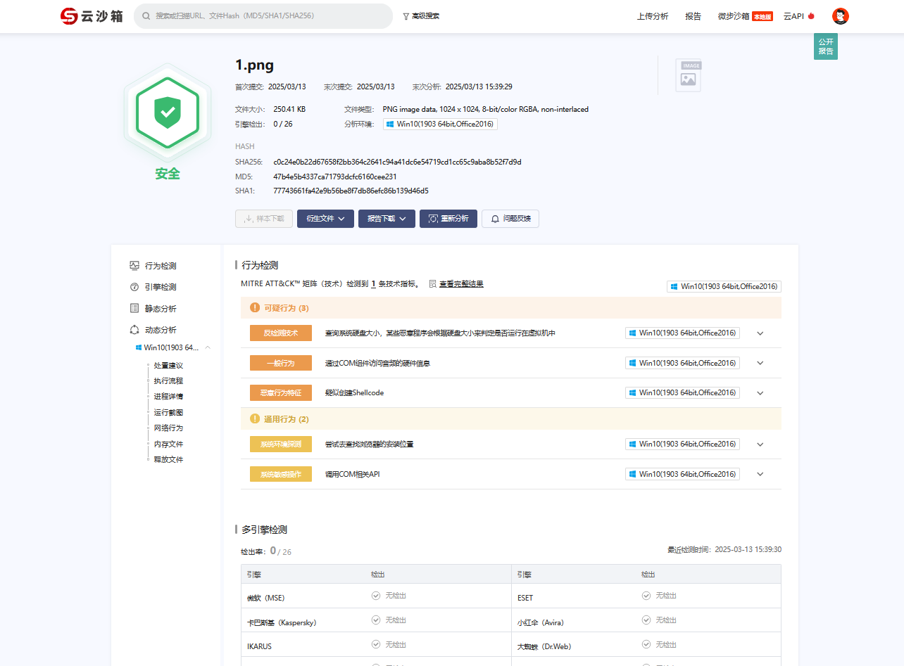
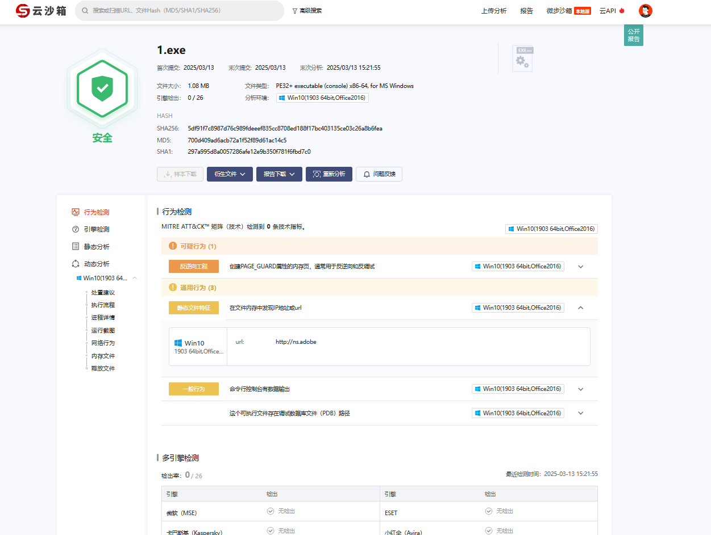

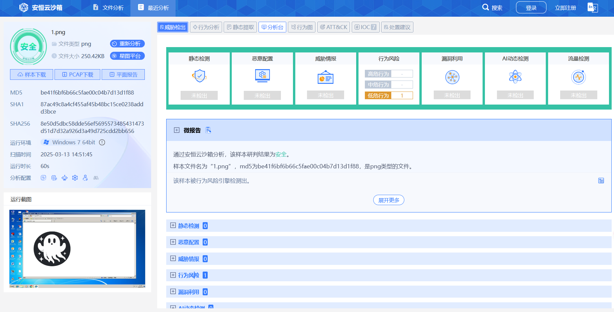
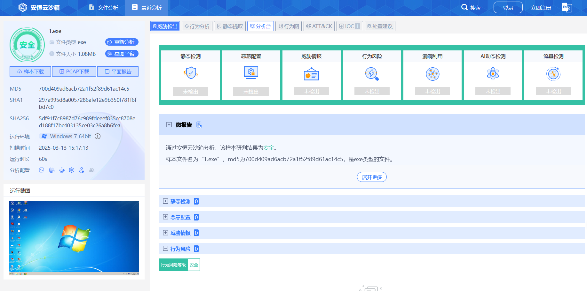


### AV
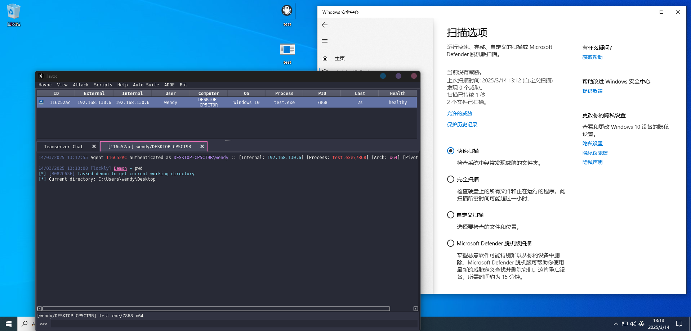
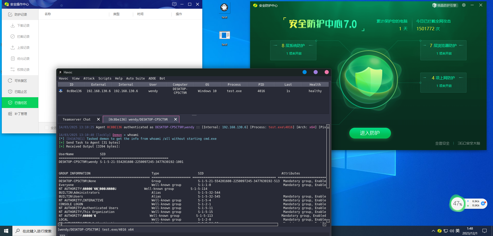
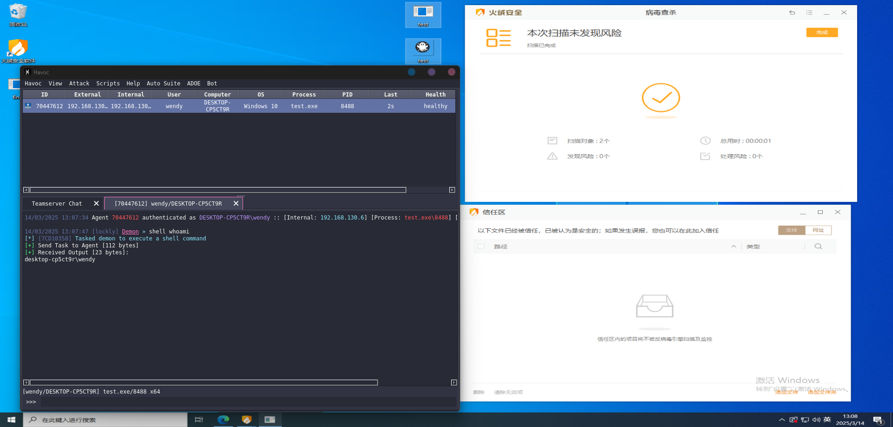
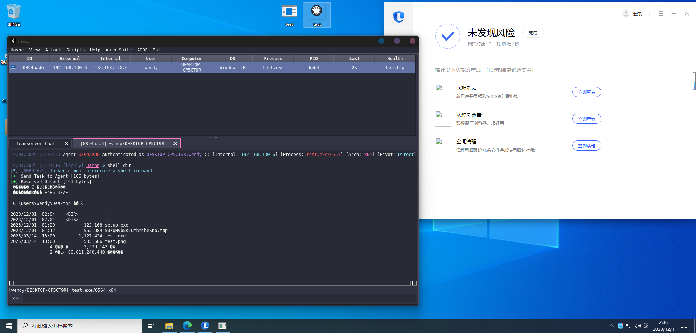

## 1.6 🤝 贡献与协议

* 欢迎提交 Issue 或 PR
* 遵循 **Apache License 2.0** 协议
* 研究免责：本工具仅用于授权安全测试和防御技术研究，使用者应对其行为负全部法律责任

⚠️ 重要声明：在任何司法管辖区使用本工具进行未授权测试均属非法行为，开发者不承担任何连带责任。


---
